# Riddle Me This AI Game - Technical Documentation

## Table of Contents
1. [Project Overview](#project-overview)
2. [Architecture Analysis](#architecture-analysis)
3. [Technology Stack](#technology-stack)
4. [Code Structure](#code-structure)
5. [State Management](#state-management)
6. [AI Integration](#ai-integration)
7. [Error Handling & Resilience](#error-handling--resilience)
8. [Performance Considerations](#performance-considerations)
9. [Development Workflow](#development-workflow)
10. [Deployment & Configuration](#deployment--configuration)
11. [Testing Strategy](#testing-strategy)
12. [Security Analysis](#security-analysis)
13. [Scalability & Future Enhancements](#scalability--future-enhancements)

---

## Project Overview

**Riddle Me This AI Game** is a modern React-based web application that provides an interactive riddle-solving experience powered by AI. The game supports both single-player and two-player modes, featuring dynamic riddle generation, strategic clue systems, and real-time answer evaluation.

### Key Features
- 🤖 AI-powered riddle generation using OpenRouter API
- 🎮 Dual game modes (1-player vs 2-player competitive)
- 💡 Strategic clue system with point deduction
- 🔄 Real-time answer evaluation
- 🎯 Session-based riddle tracking to prevent duplicates
- 🛡️ Robust error handling with demo mode fallback
- 📱 Responsive design with modern UI/UX

---

## Architecture Analysis

### High-Level Architecture

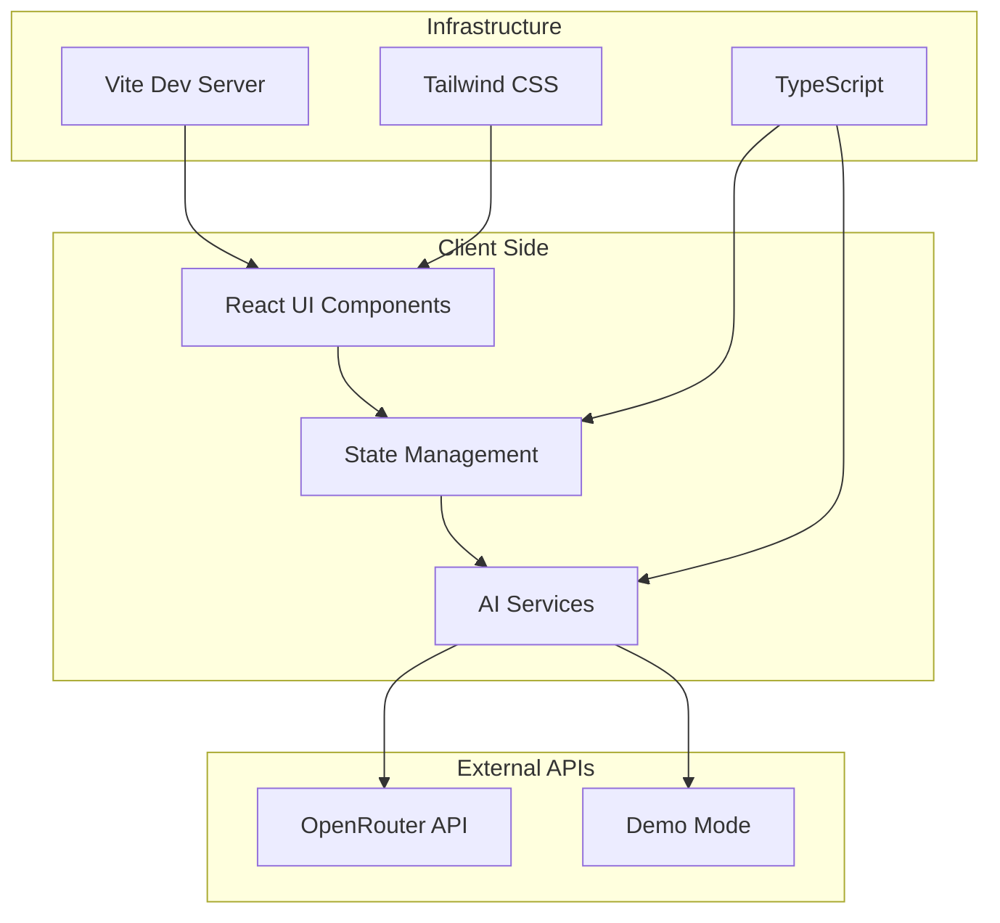

### Component Architecture

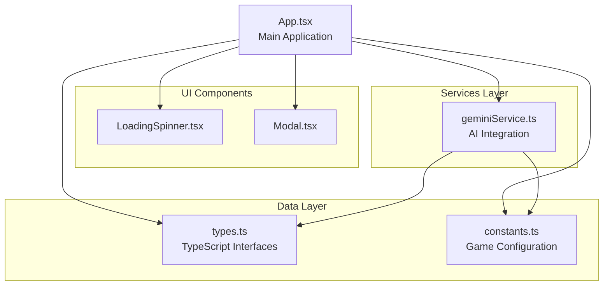

### Data Flow Architecture

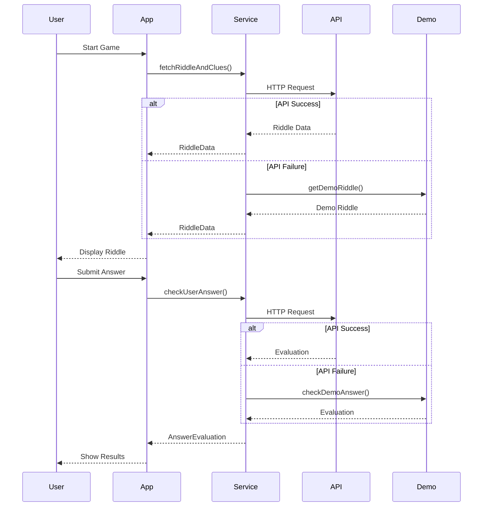

---

## Technology Stack

### Frontend Technologies
- **React 19.1.0**: Modern React with hooks for state management
- **TypeScript 5.7.2**: Type safety and enhanced developer experience
- **Vite 6.2.0**: Fast build tool and development server
- **Tailwind CSS**: Utility-first CSS framework for responsive design

### AI Integration
- **OpenRouter API**: Access to OpenAI GPT-3.5-turbo model
- **Custom Prompt Engineering**: Structured prompts for consistent responses
- **JSON Response Parsing**: Robust parsing with fallback mechanisms

### Development Tools
- **Node.js**: Runtime environment
- **npm**: Package management
- **ESLint/TypeScript**: Code quality and type checking

---

## Code Structure

### Directory Structure
```
riddle-me-this-ai-game/
├── components/           # Reusable UI components
│   ├── LoadingSpinner.tsx
│   └── Modal.tsx
├── services/            # Business logic and API integration
│   └── geminiService.ts
├── App.tsx              # Main application component
├── App-debug.tsx        # Debug version for testing
├── App-simple.tsx       # Simplified version for development
├── constants.ts         # Game configuration and constants
├── types.ts             # TypeScript type definitions
├── index.tsx            # Application entry point
├── index.html           # HTML template
├── vite.config.ts       # Vite configuration
├── tsconfig.json        # TypeScript configuration
├── package.json         # Project dependencies
└── TROUBLESHOOTING.md   # Debugging guide
```

### Key Files Analysis

#### `App.tsx` - Main Application Component
- **Size**: 449 lines
- **Complexity**: High - manages 15+ state variables
- **Responsibilities**:
  - Game state management
  - User interaction handling
  - UI rendering coordination
  - Score tracking

#### `services/geminiService.ts` - AI Service Layer
- **Size**: 261 lines
- **Complexity**: Medium-High
- **Responsibilities**:
  - API communication with OpenRouter
  - Riddle generation and validation
  - Answer evaluation
  - Demo mode fallback
  - Session-based caching

#### `types.ts` - Type Definitions
- **Size**: 27 lines
- **Complexity**: Low
- **Responsibilities**:
  - Interface definitions
  - Enum declarations
  - Type safety enforcement

---

## State Management

### State Architecture

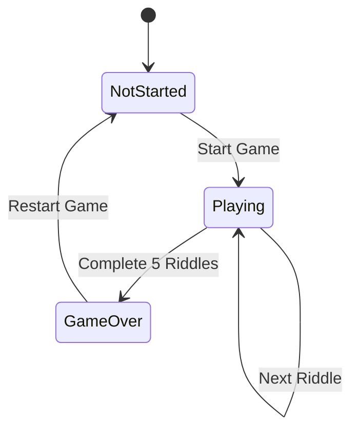

### State Variables Analysis

The application manages 15+ state variables organized into logical groups:

#### Game Configuration State
```typescript
const [gameState, setGameState] = useState<GameState>(GameState.NotStarted);
const [numPlayers, setNumPlayers] = useState<1 | 2>(1);
const [gameSession, setGameSession] = useState<string>(Date.now().toString());
```

#### Player State
```typescript
const [currentPlayer, setCurrentPlayer] = useState<1 | 2>(1);
const [activePlayerForAnswer, setActivePlayerForAnswer] = useState<1 | 2 | null>(null);
const [scores, setScores] = useState<PlayerScore>({ player1: 0, player2: 0 });
```

#### Riddle State
```typescript
const [currentRiddleData, setCurrentRiddleData] = useState<RiddleData | null>(null);
const [revealedClues, setRevealedClues] = useState<boolean[]>([]);
const [currentRiddlePotentialPoints, setCurrentRiddlePotentialPoints] = useState<number>(POINTS_PER_RIDDLE);
```

#### UI State
```typescript
const [userGuess, setUserGuess] = useState<string>('');
const [isLoading, setIsLoading] = useState<boolean>(false);
const [apiError, setApiError] = useState<string | null>(null);
const [feedbackModalOpen, setFeedbackModalOpen] = useState<boolean>(false);
```

### State Management Patterns

#### 1. **Centralized State in Main Component**
- All state managed in `App.tsx`
- No external state management library (Redux/Zustand)
- Suitable for current complexity level

#### 2. **State Reset Functions**
```typescript
const resetRiddleState = () => {
  setIsGuessSubmitted(false);
  setLastGuessEvaluation(null);
  setUserGuess('');
  setRevealedClues([]);
  setCurrentRiddlePotentialPoints(POINTS_PER_RIDDLE);
  setActivePlayerForAnswer(null);
  setApiError(null);
};
```

#### 3. **Session-Based State**
- Game session ID for tracking riddle uniqueness
- Per-session riddle caching
- Session reset on game restart

---

## AI Integration

### API Architecture

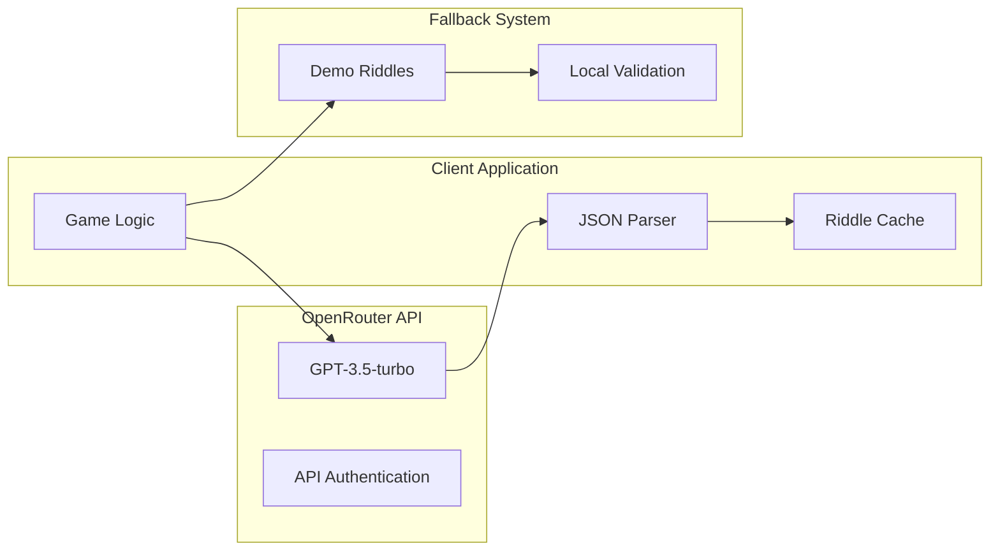

### Prompt Engineering

#### Riddle Generation Prompt
```typescript
export const riddleGenerationPrompt = `
Generate a unique and engaging riddle suitable for a general audience.
IMPORTANT: Create a completely original riddle that is unlikely to be commonly known.
Also provide the single, most common answer to the riddle.
Finally, create 4 distinct clues that progressively help in solving the riddle, but do not give the answer away too easily.

Return the response as a JSON object with the following exact structure:
{
  "riddle": "The text of the riddle itself.",
  "answer": "The correct answer to the riddle.",
  "clues": [
    "First clue text.",
    "Second clue text.",
    "Third clue text.",
    "Fourth clue text."
  ]
}
`;
```

#### Answer Evaluation Prompt
```typescript
export const answerCheckingPrompt = (riddle: string, correctAnswer: string, userAnswer: string): string => `
You are an impartial judge for a riddle game.
The riddle was: "${riddle}"
The generally accepted correct answer is: "${correctAnswer}"
The user has submitted the answer: "${userAnswer}"

Please determine if the user's answer is correct. Consider minor misspellings, singular/plural forms, or very close synonyms as correct if the core meaning matches the accepted answer.
Respond with a JSON object with the following exact structure:
{
  "isCorrect": boolean
}
`;
```

### Response Parsing

#### Robust JSON Parsing
```typescript
function parseGeminiJsonResponse<T>(responseText: string): T | null {
  let jsonStr = responseText.trim();
  // Regex to remove optional markdown fences (```json ... ``` or ``` ... ```)
  const fenceRegex = /^```(?:json)?\s*\n?(.*?)\n?\s*```$/s;
  const match = jsonStr.match(fenceRegex);
  if (match && match[1]) {
    jsonStr = match[1].trim();
  }
  
  try {
    return JSON.parse(jsonStr) as T;
  } catch (error) {
    // Attempt to find JSON within a potentially larger string
    const jsonWithinStringMatch = jsonStr.match(/({[\s\S]*}|\[[\s\S]*\])/);
    if (jsonWithinStringMatch && jsonWithinStringMatch[0]) {
      try {
        return JSON.parse(jsonWithinStringMatch[0]) as T;
      } catch (e) {
        console.error("Failed to parse extracted JSON:", e);
      }
    }
    return null;
  }
}
```

### Caching Strategy

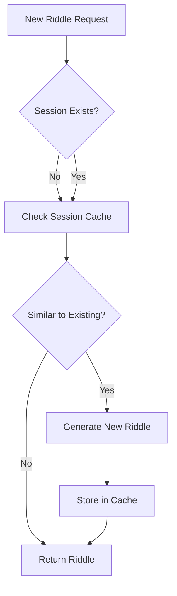

---

## Error Handling & Resilience

### Error Handling Architecture

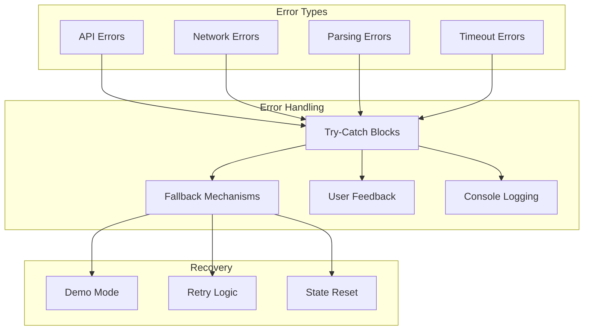

### Resilience Patterns

#### 1. **API Fallback System**
```typescript
export const fetchRiddleAndClues = async (sessionId: string = 'default'): Promise<RiddleData | AIServiceError> => {
  // API Key validation
  if (!API_KEY || API_KEY === 'your_openrouter_api_key_here') {
    return getDemoRiddle(sessionId);
  }
  
  // Retry logic with timeout
  const maxAttempts = 3;
  let attempts = 0;
  
  while (attempts < maxAttempts) {
    try {
      const controller = new AbortController();
      const timeoutId = setTimeout(() => controller.abort(), 30000);
      
      // API call with timeout
      const response = await fetch(url, { signal: controller.signal });
      
      // Handle response
      if (!response.ok) {
        throw new Error(`API error: ${response.status}`);
      }
      
      return parsedData;
    } catch (error) {
      attempts++;
      if (attempts >= maxAttempts) {
        return getDemoRiddle(sessionId); // Fallback to demo
      }
    }
  }
};
```

#### 2. **Timeout Handling**
- 30-second timeout for API requests
- AbortController for request cancellation
- Graceful degradation to demo mode

#### 3. **User-Friendly Error Messages**
```typescript
if (apiError && !currentRiddleData) { 
  return <div className="text-center p-8">
    <h2 className="text-2xl text-red-400 mb-4">Oops! Something went wrong.</h2>
    <p className="text-slate-300 mb-4">{apiError}</p>
    <div className="bg-slate-700 p-4 rounded-md mb-6 text-left">
      <h3 className="text-lg font-semibold text-yellow-400 mb-2">Troubleshooting:</h3>
      <ul className="text-sm text-slate-300 space-y-1">
        <li>• Check your internet connection</li>
        <li>• Verify API key is set in .env.local file</li>
        <li>• Open browser console (F12) for detailed error messages</li>
        <li>• Try refreshing the page</li>
      </ul>
    </div>
    // Recovery buttons
  </div>;
}
```

---

## Performance Considerations

### Performance Analysis

#### Bundle Size Optimization
- **Vite**: Fast build tool with tree-shaking
- **ESM Modules**: Modern module system
- **TypeScript**: Compile-time optimizations

#### Runtime Performance
- **React 19**: Latest React with performance improvements
- **useCallback**: Memoized functions to prevent unnecessary re-renders
- **State Optimization**: Minimal state updates

#### Network Performance
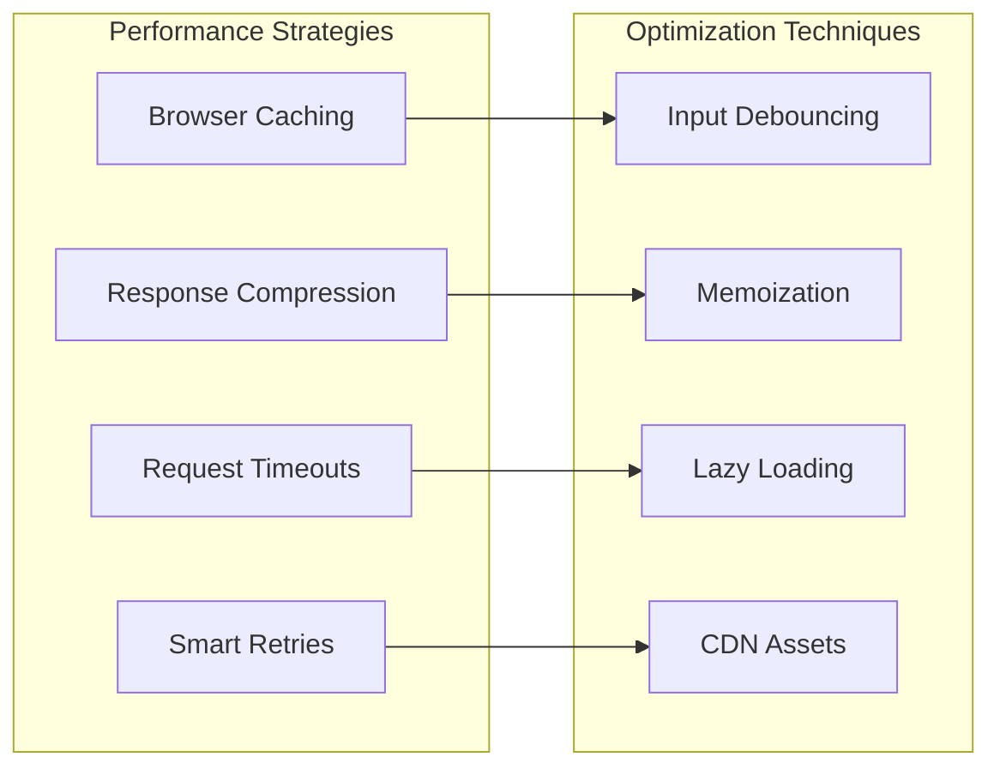

### Memory Management

#### Caching Strategy
```typescript
// Session-based caching
const riddlesBySession: Map<string, Set<string>> = new Map();

// Global caching for cross-session deduplication
const previousRiddles: Set<string> = new Set();
```

#### Memory Leaks Prevention
- Proper cleanup of timeouts
- Component unmounting handling
- Event listener cleanup

---

## Development Workflow

### Build Configuration

#### Vite Configuration
```typescript
export default defineConfig(({ mode }) => {
  const env = loadEnv(mode, '.', '');
  return {
    define: {
      'process.env.API_KEY': JSON.stringify(env.VITE_OPENROUTER_API_KEY),
      'process.env.VITE_OPENROUTER_API_KEY': JSON.stringify(env.VITE_OPENROUTER_API_KEY)
    },
    resolve: {
      alias: {
        '@': path.resolve(__dirname, '.'),
      }
    }
  };
});
```

#### TypeScript Configuration
```json
{
  "compilerOptions": {
    "target": "ES2020",
    "module": "ESNext",
    "lib": ["ES2020", "DOM", "DOM.Iterable"],
    "strict": true,
    "noUnusedLocals": true,
    "noUnusedParameters": true,
    "jsx": "react-jsx"
  }
}
```

### Development Scripts
```json
{
  "scripts": {
    "dev": "vite",
    "build": "vite build",
    "preview": "vite preview"
  }
}
```

### Environment Configuration
```bash
# .env.local
VITE_OPENROUTER_API_KEY=your_api_key_here
```

---

## Deployment & Configuration

### Build Process

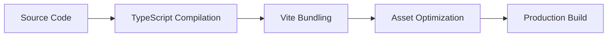

### Production Considerations
- Environment variable configuration
- API key security
- Static asset optimization
- CDN deployment readiness

### Configuration Files
- `vite.config.ts`: Build configuration
- `tsconfig.json`: TypeScript configuration
- `package.json`: Dependencies and scripts
- `.env.local`: Environment variables

---

## Testing Strategy

### Current Testing Approach
- Manual testing through debug components
- Console-based debugging
- Error boundary testing

### Recommended Testing Strategy

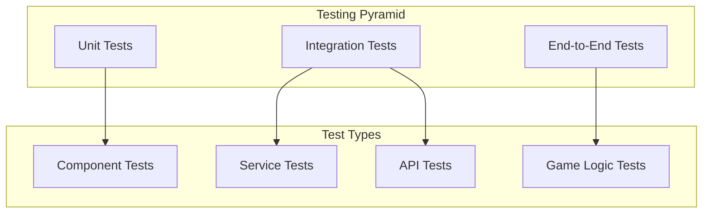

### Testing Recommendations
1. **Unit Tests**: Component rendering and state management
2. **Integration Tests**: API service integration
3. **E2E Tests**: Complete game flow testing
4. **Mock Tests**: API response mocking

---

## Security Analysis

### Security Considerations

#### API Key Security
```typescript
// Environment variable usage
const API_KEY = process.env.VITE_OPENROUTER_API_KEY;

// Client-side exposure risk
// Note: VITE_ prefixed variables are exposed to client
```

#### Input Validation
```typescript
// User input sanitization
const normalizedUser = userAnswer.toLowerCase().trim();
const normalizedCorrect = correctAnswer.toLowerCase().trim();
```

#### XSS Prevention
- React's built-in XSS protection
- No innerHTML usage
- Controlled component rendering

### Security Recommendations
1. **API Key Management**: Use server-side proxy for production
2. **Input Sanitization**: Implement comprehensive input validation
3. **Rate Limiting**: Implement client-side rate limiting
4. **HTTPS**: Ensure secure connections in production

---

## Scalability & Future Enhancements

### Current Limitations
- Single-page application architecture
- Client-side state management
- Limited offline capabilities
- No user authentication

### Scalability Roadmap

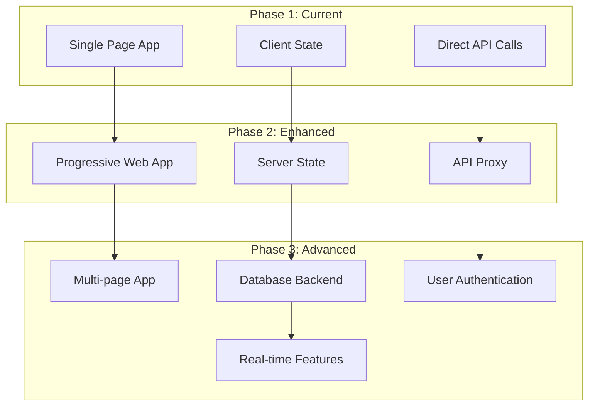

### Recommended Enhancements

#### 1. **Backend Integration**
- Express.js server for API proxying
- Database for user data and riddle storage
- User authentication system

#### 2. **Advanced Features**
- Real-time multiplayer support
- Riddle categories and difficulty levels
- User profiles and statistics
- Social features (leaderboards, sharing)

#### 3. **Performance Optimizations**
- Service worker for offline support
- Advanced caching strategies
- Code splitting and lazy loading
- CDN integration

#### 4. **Development Improvements**
- Comprehensive testing suite
- CI/CD pipeline
- Code quality tools
- Documentation automation

---

## Conclusion

The **Riddle Me This AI Game** represents a well-architected modern React application that successfully integrates AI capabilities with engaging gameplay. The codebase demonstrates:

### Strengths
- ✅ **Clean Architecture**: Well-organized component structure
- ✅ **Type Safety**: Comprehensive TypeScript implementation
- ✅ **Error Resilience**: Robust error handling with fallbacks
- ✅ **User Experience**: Intuitive UI with responsive design
- ✅ **AI Integration**: Effective prompt engineering and response parsing
- ✅ **Performance**: Optimized build and runtime performance

### Areas for Improvement
- 🔄 **Testing**: Comprehensive test coverage needed
- 🔄 **Backend**: Server-side architecture for production
- 🔄 **Security**: Enhanced API key management
- 🔄 **Scalability**: Multi-user and real-time features
- 🔄 **Documentation**: API documentation and code comments

### Technical Debt
- State management complexity in main component
- Limited offline capabilities
- Client-side API key exposure
- Manual error handling without error boundaries

This application serves as an excellent foundation for a production-ready riddle game platform with significant potential for expansion and enhancement.
